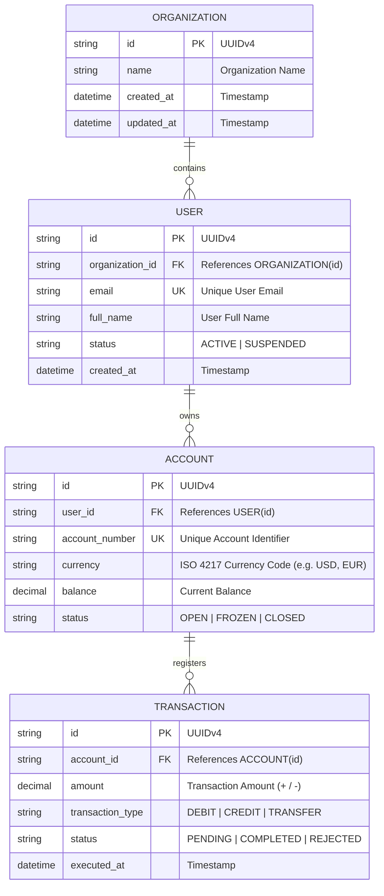

# Modelo de Datos del Dominio y Especificaciones de Entidades

Este documento vivo representa la única fuente de verdad (single source of truth) para las entidades de dominio, modelos relacionales y contratos de datos en toda la aplicación.

---

## 1. Diagrama Entidad-Relación (ERD)

---

## 2. Esquemas de Entidades e Invariantes

### 2.1 Invariantes de Entidad
1. **Precisión y Monedas**: Todos los montos monetarios deben usar decimales de punto fijo exactos (`decimal` / unidades menores enteras) en lugar de números de punto flotante para evitar artefactos de redondeo.
2. **Inmutabilidad de Transacciones**: Una vez que la entidad `TRANSACTION` alcanza el estado `COMPLETED` o `REJECTED`, sus atributos no pueden ser modificados. Las reversiones compensatorias deben registrarse como eventos de transacción distintos.
3. **Pistas de Auditoría (Audit Trails)**: Todo aggregate root debe mantener marcas de tiempo (timestamps) para `created_at` y `updated_at`.

---

## 3. Protocolos de Migración y Evolución
- Las alteraciones del esquema deben acompañarse de un script de migración ejecutable y la correspondiente actualización en este documento.
- Los cambios de esquema que rompan compatibilidad (breaking changes) requieren planes de transición versionados.
